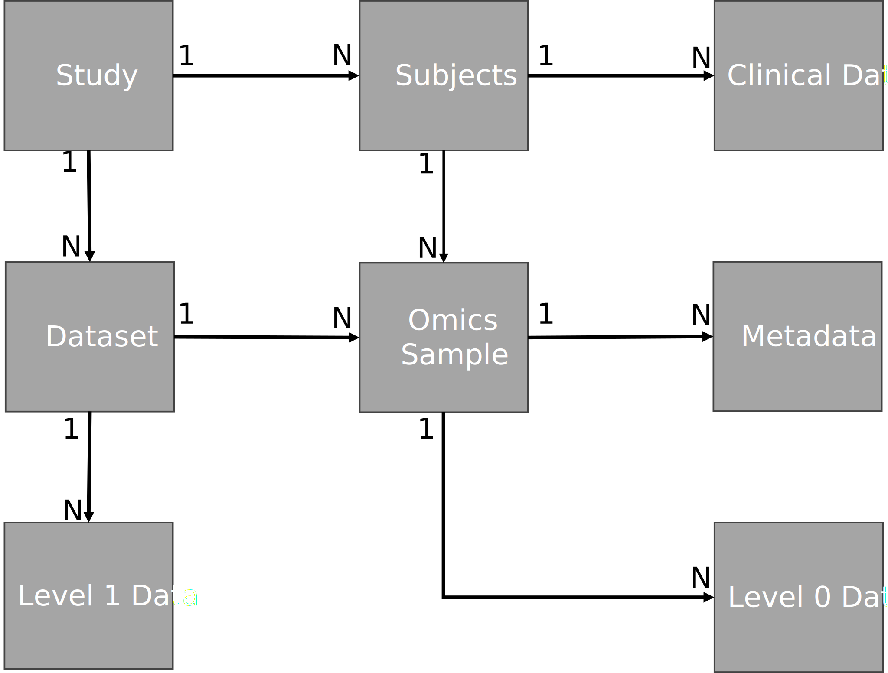
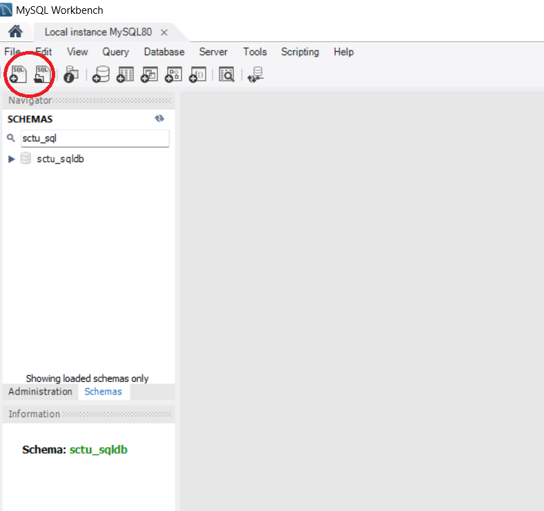
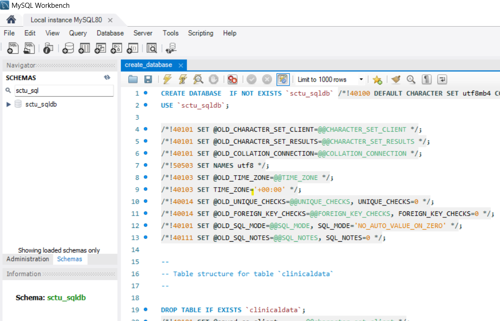
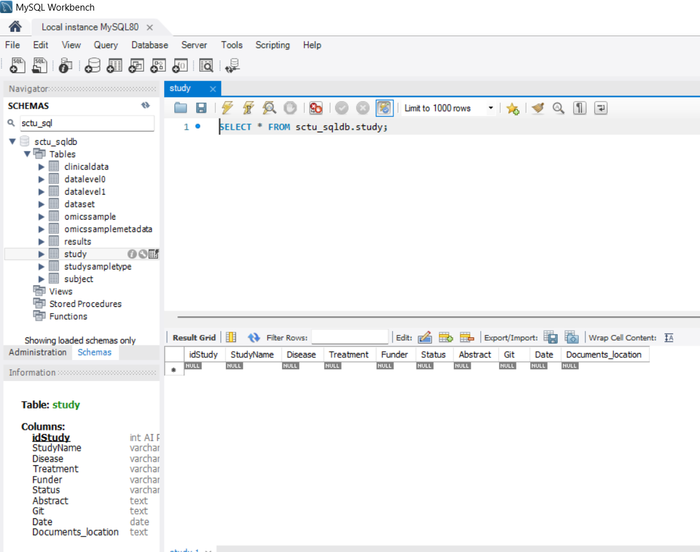

# An Open-Source SQL Database Schema for Integrated Clinical and Translational Data Management in Cancer Research  - perspective of a UKCRC clinical trials unit

# Supplementary Material

**Methods and Implementation**

This section describes the design and implementation details of the SQL database schema for integrated clinical and translational data management in a clinical trials unit setting.

**Schema Design**



**Figure 1:** This diagram depicts the relationships between core entities within the open-source SQL database schema. It serves as a blueprint for the database, designed to integrate clinical and translational data across diverse research studies. The key entities include: **Study:** Represents a clinical trial, encompassing details such as disease focus, treatment arms, and status; **Subject:** Captures information about study participants, including anonymized IDs, visit timestamps, and unique data points (combination of subject ID and visit); **Clinical Data:** Stores patient-specific clinical data collected throughout the study (e.g., vital signs, lab results); **Dataset:** Represents each omics dataset generated from a specific study, linked to the Study table; **Omics Sample:** Represents a biological sample used for omics analysis, linked to both the Dataset and Subject tables; **Metadata:** This includes associated metadata about processing details and sample quality; **Data Level 0:** Stores information about raw data files associated with omics samples (e.g., location of FASTQ files from nextgen genomic sequencing); **Data Level 1:** Represents processed and analysis-ready data files derived from omics samples, typically in a feature-by-sample matrix format linked to the Dataset table. **Relationships:** Lines represent relationships between entities; Arrows indicate the direction of the relationship (e.g., one-to-many).

## Example Guide to setup the Database

This guide walks the reader through setting up the SQL database using [MySQL Workbench](https://www.mysql.com/products/workbench/). The installation instructions for popular operating systems can be seen in the [installation manual](https://dev.mysql.com/doc/workbench/en/wb-installing.html). After the installation is finished, a new connection to the SQL server needs to be established, and this can be done using the instructions in the [manual](https://dev.mysql.com/doc/workbench/en/wb-getting-started-tutorial-create-connection.html). A walk through for the MySQL Workbench user interface can be seen in the [manual](https://dev.mysql.com/doc/workbench/en/wb-sql-editor.html).

After completing the installation steps and making a connection to the server, the clinical data database can be setup following the steps:

1- Download the the create_database.sql script from [here](https://github.com/uhkniazi/SCTU_SQLDB_Supplementary/blob/master/create_database.sql).

2- Select open in MySQL Workbench to open this downloaded script.



3- Execute the selected script to create the empty database.



## Entering Data in the Database.

Once the database is created, the data can be entered by selecting the table as shown in the figure.



As this is a relational database, the data as to be entered in an order that maintains data relationships and integrity. Looking at the ER diagram shown earlier, if a higher level table does not have an entry, then data can not be entered into the lower level table - e.g. Clinical Data for a subject can not be filled in before filling in the information for the subject in the Subject table. For reading and writing large numbers of data we use R and show a basic example below.

```         
# connect to database
library(DBI)
library(RMySQL)

con = dbConnect(MySQL(), 
                host = '127.0.0.1',
                dbname = 'sctu_sqldb',
                user = rstudioapi::askForPassword("Database user"),
                password = rstudioapi::askForPassword("Database password"))

dbGetQuery(con, 'describe study')

## create a test data frame as example
dfStudy = data.frame(StudyName=c('my study 1', 'my study 2'),
                     Disease=c('disease A', 'disease B'))

### a test insert of first row
dbWriteTable(con, name='study', value = dfStudy[1,], append=T, row.names=F)

## running this may sometime give an error which will look like this:
# Error in dbSendQuery(conn, statement, ...) : 
# could not run statement: Loading local data is disabled; this must be enabled
# on both the client and server sides
# it is explained here: https://stackoverflow.com/questions/59993844/error-loading-local-data-is-disabled-this-must-be-enabled-on-both-the-client
# you can get around it by executing:
dbGetQuery(con, 'set global local_infile=true;')

## enter the full data frame
dbWriteTable(con, name='study', value = dfStudy, append=T, row.names=F)

dbDisconnect(con)
```

## Reading Data from Database

Reading the data from the database (once the data has been entered) is straight forward using either the MySQL client or writing queries directly into an SQL client. We show an example of reading the data from the Clinical Data table for a study and summarizing the types of measurements available.

```         
## how many types of clinical data are for study X
dfRes = dbGetQuery(con, "select count(*) counts, Type from clinicaldata
where Study_idStudy=2
group by Type")

head(dfRes)
```

Writing more complicated queries is beyond the scope of this tutorial but there are several easy to find resources available to get started.
